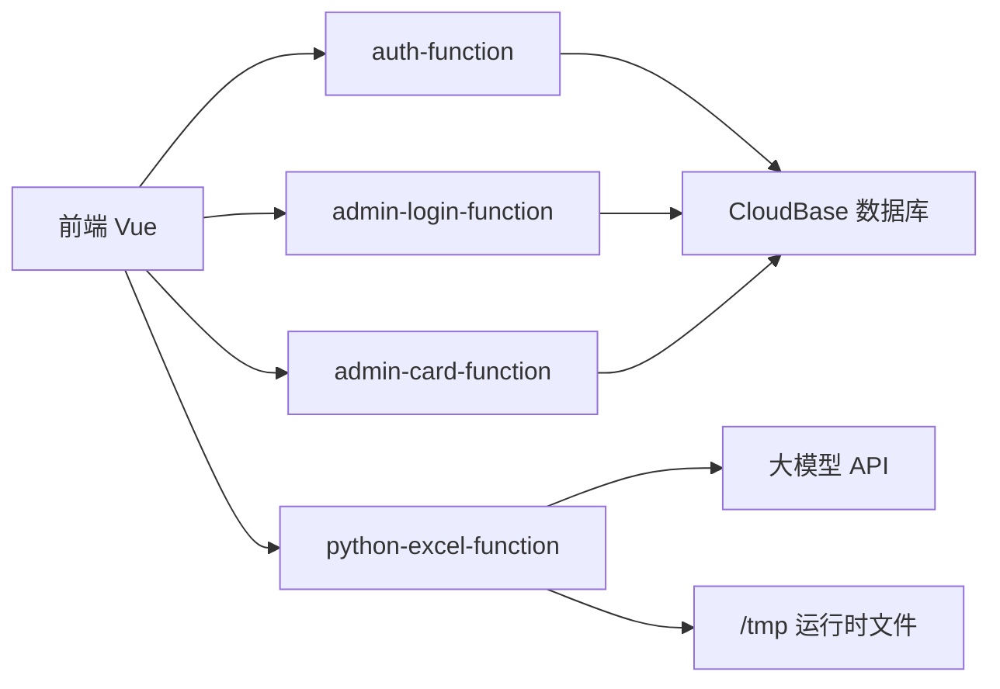

# Backend README

本项目的后端不是单一服务，而是一个混合式后端体系：

- Node 云函数负责鉴权与后台管理
- Python 云函数负责 Excel 上传、解析、翻译、结果生成
- 本地 Python API 仅用于开发调试

如果你后续要继续扩展这个项目，建议优先把这份文档当成“后端模板说明”。

## 1. 后端架构概览



## 2. 后端职责拆分

### Node 云函数

负责：

- 卡密校验
- 管理员登录
- 管理员后台 CRUD
- 用户计费/配额规则的一部分

### Python 云函数

负责：

- 上传分片初始化
- 追加上传分片
- 完成上传
- 解析 Excel 预览
- 调用大模型翻译
- 生成结果文件
- 分片下载结果文件

### 本地 Python API

负责：

- 本地调试
- 便于脱离云端快速验证 Excel 处理逻辑

不作为当前推荐生产主链路。

## 3. 目录与模块

### 3.1 Node 云函数

- [cloudfunctions/auth-function](/Users/ricardo/文稿/创业/软件服务脚本/excel智能翻译vue/cloudfunctions/auth-function)
- [cloudfunctions/admin-login-function](/Users/ricardo/文稿/创业/软件服务脚本/excel智能翻译vue/cloudfunctions/admin-login-function)
- [cloudfunctions/admin-card-function](/Users/ricardo/文稿/创业/软件服务脚本/excel智能翻译vue/cloudfunctions/admin-card-function)

### 3.2 Python 云函数

当前推荐生产版本：

- [cloudfunctions/python-excel-function-normal](/Users/ricardo/文稿/创业/软件服务脚本/excel智能翻译vue/cloudfunctions/python-excel-function-normal)

推荐上传包：

- [cloudfunctions/python-excel-function-normal.zip](/Users/ricardo/文稿/创业/软件服务脚本/excel智能翻译vue/cloudfunctions/python-excel-function-normal.zip)

### 3.3 本地 Python API

- [python_backend/app.py](/Users/ricardo/文稿/创业/软件服务脚本/excel智能翻译vue/python_backend/app.py)
- [python_backend/requirements.txt](/Users/ricardo/文稿/创业/软件服务脚本/excel智能翻译vue/python_backend/requirements.txt)

### 3.4 Excel 核心处理逻辑

- [core/excel_parser.py](/Users/ricardo/文稿/创业/软件服务脚本/excel智能翻译vue/core/excel_parser.py)

这是整个模板最核心的后端能力。

## 4. 当前推荐生产方案

### 4.1 Node 云函数

继续使用：

- `auth-function`
- `admin-login-function`
- `admin-card-function`

### 4.2 Python 云函数

使用：

- `python-excel-function`

部署方式：

- 普通函数
- Python 3.10
- 入口函数：`index.main_handler`

### 4.3 不再推荐作为主链路的旧方案

以下目录主要属于历史方案或中间实验产物：

- `cloudfunctions/parse-function`
- `cloudfunctions/translate-function`
- `cloudfunctions/upload-file-function`
- `cloudfunctions/python-excel-function`
- `cloudfunctions/python-excel-function-deploy`

新项目建议直接基于 `python-excel-function-normal` 继续演进。

## 5. Python 云函数路由

普通云函数直调时，前端通过 `callFunction` 传递 `__route`，当前支持的主要路由有：

- `/health`
- `/upload-file-function`
- `/parse-function`
- `/translate-function`
- `/download-result-info`
- `/download-result-chunk`

入口文件：

- [cloudfunctions/python-excel-function-normal/index.py](/Users/ricardo/文稿/创业/软件服务脚本/excel智能翻译vue/cloudfunctions/python-excel-function-normal/index.py)

## 6. Excel 翻译核心能力

### 6.1 为什么采用 XML 直改

纯 `openpyxl save` 在复杂工作簿里很容易丢：

- shape 文本
- drawing 结构
- 某些原始 XML 信息

所以当前后端采用的是：

- 先读取原始 xlsx zip
- 解析要翻译的 XML 节点
- 调用模型翻译
- 将译文直接写回原始 XML
- 重新打包成新的 xlsx

### 6.2 已支持的文本来源

- `sharedStrings.xml`
- worksheet XML 中普通字符串
- `inlineStr`
- `str`
- `drawing.xml` 中的 shape / 文本框文本

### 6.3 核心文件

- [core/excel_parser.py](/Users/ricardo/文稿/创业/软件服务脚本/excel智能翻译vue/core/excel_parser.py)

这个文件后续改动时要非常谨慎。

## 7. 后端数据流

### 上传阶段

1. 前端调用 `/upload-file-function` 初始化上传
2. 前端按 chunk 逐段上传 Base64
3. 云函数把分片顺序写入一个最终文件
4. 完成后把会话状态改成 `completed`

### 解析阶段

1. 云函数读取完整上传文件
2. 用 `openpyxl` 获取工作表结构
3. 用 XML 逻辑提取 shape 文本
4. 生成预览数据返回前端

### 翻译阶段

1. 云函数提取目标工作表的原始文本映射
2. 分批调用大模型
3. 合并译文结果
4. 回写原始 XML
5. 输出结果文件

### 下载阶段

1. 前端先取结果文件信息
2. 再按 chunk 拉取结果文件
3. 浏览器拼成 Blob 下载

## 8. 数据模型

### 管理员集合

参考：

- [Admin_DB_Schema.md](/Users/ricardo/文稿/创业/软件服务脚本/excel智能翻译vue/Admin_DB_Schema.md)

集合：

- `admin_users`

主要字段：

- `username`
- `password_hash`
- `status`
- `role`
- `created_at`
- `last_login_at`

### 卡密集合

当前主要集合：

- `card_secrets`

常见字段：

- `key`
- `card_type`
- `status`
- `total_count`
- `used_count`
- `expires_at`
- `period`
- `last_reset_at`
- `user_id`

## 9. 环境变量

### 9.1 Node 云函数

关键变量：

- `ADMIN_AUTH_SECRET`

必须在这些函数里保持一致：

- `admin-login-function`
- `admin-card-function`
- `auth-function`

### 9.2 Python 云函数

关键变量：

- `OPENAI_API_KEY`
- `OPENAI_BASE_URL`
- `MODEL_NAME`
- `PY_API_PREFIX=/python-api`

说明：

- `PY_API_PREFIX` 现在主要用于兼容旧路由
- 当前生产链路已经不需要 HTTP 访问服务

## 10. 运行时目录与云端限制

### 10.1 可写目录

CloudBase 普通函数代码目录是只读的。

当前已经处理为：

- 本地开发：写仓库内 `.runtime`
- 云端运行：写 `/tmp/python-excel-function-runtime`

### 10.2 超时

建议配置：

- 前端 `callFunction` 超时：`180000ms`
- Python 云函数超时：`300 秒`

### 10.3 内存

推荐：

- 小文件：`1024MB`
- 大工作簿：`2048MB`

因为翻译阶段会出现：

- 解压 xlsx
- 提取工作表数据
- 提取 drawing 文本
- 构建翻译映射
- 重新打包结果文件

这些会显著抬高内存峰值。

## 11. 常见故障与经验

### 11.1 `EXCEED_MAX_PAYLOAD_SIZE`

原因：

- 一次性提交整个文件体积太大

当前方案：

- 前端分片上传

### 11.2 `FUNCTION_TIME_LIMIT_EXCEEDED`

原因：

- 云函数执行过久
- 或前端调用超时先取消

处理：

- 提高云函数超时
- 提高前端 `callFunction` 超时

### 11.3 `FUNCTIONS_MEMORY_LIMIT_EXCEEDED`

原因：

- 翻译阶段内存不足

处理：

- 提高 Python 云函数内存

### 11.4 `Read-only file system`

原因：

- 试图往云函数代码目录写临时文件

处理：

- 统一使用 `/tmp/python-excel-function-runtime`

### 11.5 HTTP 访问服务关联失败

当前结论：

- 生产主链路已经不依赖 HTTP 访问服务
- 不建议继续投入精力在这一层

## 12. 本地后端调试

### 本地 Python API

脚本：

- [scripts/run_python_api.sh](/Users/ricardo/文稿/创业/软件服务脚本/excel智能翻译vue/scripts/run_python_api.sh)

启动：

```bash
bash scripts/run_python_api.sh
```

默认地址：

- `http://127.0.0.1:8000`

### 本地 Node 云函数

当前仓库默认以云端 CloudBase 为主，不提供本地完整模拟。

## 13. 后端开发规范

### 13.1 Node 云函数规范

参考：

- [接口规范.md](/Users/ricardo/文稿/创业/软件服务脚本/excel智能翻译vue/接口规范.md)

要求：

- 统一返回结构
- 参数校验明确
- 业务错误和系统错误区分
- 日志清晰

### 13.2 Python 云函数规范

- 新逻辑优先加到 `python-excel-function-normal`
- 不在只读目录写文件
- 每次改动都要考虑内存与超时
- 返回结构尽量和前端当前封装兼容
- 下载逻辑不要改回直链式 HTTP 依赖

### 13.3 Excel 处理规范

- 不要轻易放弃 XML 直改
- 不要退回纯 `openpyxl.save()` 方案
- shape/sharedStrings/worksheet XML 改动必须回归验证

## 14. 给 AI 的后端改造规则

如果以后你要让 AI 改后端，建议把这段直接贴给它：

```text
这是一个 Node 云函数 + Python 云函数的混合后端模板。
请遵守以下规则：
1. 鉴权、管理员后台继续使用 Node 云函数。
2. 上传、解析、翻译、下载结果继续使用 python-excel-function。
3. 生产环境不要重新引入 HTTP 访问服务作为主链路。
4. Excel 翻译必须保留 sharedStrings、worksheet XML、drawing shape 文本处理。
5. 修改 Python 云函数时必须考虑 CloudBase 的超时、内存、只读文件系统限制。
6. 不能把真实业务改成假数据或模拟翻译。
7. 如果新增环境变量，要同步更新 README 和部署说明。
8. 如果改下载逻辑，不能破坏分片下载结果文件的机制。
```

## 15. 新项目复用建议

如果你要基于这个模板启动新项目，建议顺序如下：

1. 替换项目名与产品文案
2. 替换数据库集合与字段命名
3. 替换模型服务提供商
4. 替换卡密规则
5. 保留 Excel 解析核心逻辑
6. 用真实样本重新验证 shape/sharedStrings
7. 再交给 AI 做业务层改造

## 16. 不建议直接删掉的文件

这些文件看起来像“旧代码”，但短期内不建议随手删：

- [core/excel_parser.py](/Users/ricardo/文稿/创业/软件服务脚本/excel智能翻译vue/core/excel_parser.py)
- [cloudfunctions/python-excel-function-normal/index.py](/Users/ricardo/文稿/创业/软件服务脚本/excel智能翻译vue/cloudfunctions/python-excel-function-normal/index.py)
- [frontend/src/api/python.ts](/Users/ricardo/文稿/创业/软件服务脚本/excel智能翻译vue/frontend/src/api/python.ts)

这些是现在整套系统能跑起来的关键连接点。
