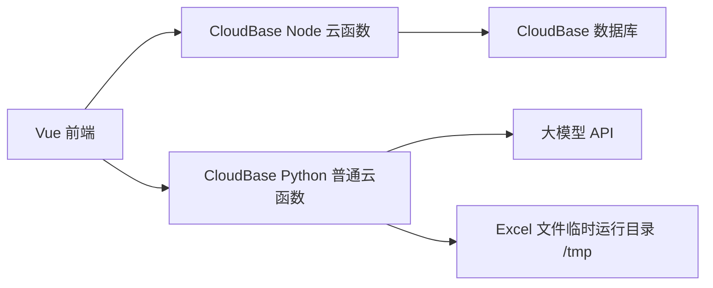

# Excel 智能翻译平台模板

一个可复用的 Excel 翻译后台模板，适合继续演化为“上传文件 -> 解析预览 -> 调用大模型翻译 -> 生成结果文件 -> 管理卡密/管理员”的 SaaS 或内部工具项目。

当前仓库已经打通以下能力：

- 前端上传、解析、翻译、下载完整链路
- 管理员登录与后台卡密管理
- 云函数版生产部署
- 本地 Python 服务调试
- Excel 形状文本、共享字符串、普通单元格文本翻译

这份 README 的目标不是只说明“怎么跑”，而是把这个项目整理成后续可直接拿来指导 AI 改造的新项目模板。

## 1. 项目定位

这是一个“前台翻译工作台 + 后台卡密管理 + 云端翻译执行”的混合架构项目。

核心用途：

- 用户上传 Excel 文件
- 系统解析工作簿中的可翻译文本
- 调用大模型进行翻译
- 生成新的 Excel 文件供下载
- 通过卡密系统控制使用次数/有效期
- 提供管理员后台进行卡密增删改查

## 2. 当前已实现功能

### 2.1 翻译工作台

- 上传 Excel 文件
- 自动解析工作表名称与预览内容
- 支持按单工作表翻译
- 支持按整文件翻译
- 支持结果文件下载
- 支持上传/解析/翻译/下载进度反馈

### 2.2 Excel 文本提取与回写

以下三类文本已经纳入真实翻译链路：

- `sharedStrings.xml` 中的共享字符串
- worksheet XML 中的普通单元格文本
- `drawing.xml` 中的形状文本 / 文本框文本

这部分是当前模板最重要的可复用资产之一。

### 2.3 卡密体系

当前支持的卡密类型：

- `sheet_count`：单 Sheet 计次卡
- `file_count`：整文件计次卡
- `time`：时间卡
- `admin`：管理员卡/管理员态

后台支持：

- 管理员登录
- 卡密列表查询
- 新增卡密
- 编辑卡密
- 删除卡密
- 统计数展示

### 2.4 管理后台

- 管理员会话登录
- 卡密统计概览
- 卡密列表与搜索
- 批量生成风格的录入交互
- 响应式布局适配

## 3. 技术栈

### 前端

- Vue 3
- Vite
- TypeScript
- Pinia
- Vue Router
- Element Plus
- Axios
- `@cloudbase/js-sdk`

### 云端 / 服务端

- 腾讯云 CloudBase
- Node.js 云函数
- Python 云函数
- FastAPI（本地调试服务）
- `openpyxl`
- `httpx`

### 核心文档解析实现

- Python 标准库 `zipfile`
- `xml.etree.ElementTree`
- `openpyxl`

## 4. 架构说明

### 4.1 推荐生产架构



### 4.2 职责拆分

Node 云函数负责：

- 用户/卡密鉴权
- 管理员登录
- 卡密后台 CRUD

Python 云函数负责：

- 上传分片接收
- Excel 解析
- 大模型翻译
- 结果文件生成
- 结果文件分片下载

### 4.3 当前主链路

生产环境当前已经改为：

- 前端通过 `CloudBase JS SDK -> callFunction`
- 直接调用普通 Python 云函数 `python-excel-function`
- 不再依赖 `HTTP 访问服务`

这是当前模板的推荐生产方案。

## 5. 目录结构

```text
.
├── frontend/                        前端 Vue 应用
├── cloudfunctions/                  云函数目录
│   ├── auth-function/               卡密鉴权
│   ├── admin-login-function/        管理员登录
│   ├── admin-card-function/         后台卡密管理
│   ├── python-excel-function-normal/ 推荐生产用 Python 普通云函数
│   ├── parse-function/              旧版 Node 解析函数（已非主链路）
│   ├── translate-function/          旧版 Node 翻译函数（已非主链路）
│   └── upload-file-function/        旧版上传函数（已非主链路）
├── core/
│   └── excel_parser.py              Excel XML 解析与回写核心逻辑
├── python_backend/                  本地 Python API 调试服务
├── scripts/                         辅助脚本
├── Admin_DB_Schema.md               管理员/数据库结构说明
├── 接口规范.md                      云函数接口返回规范
├── 接口设计.md                      接口设计文档
├── Serverless_Architecture.md       架构说明
└── 部署说明_CloudBase_Python.md     Python 云函数部署说明
```

## 6. 关键实现说明

### 6.1 为什么 Excel 翻译不能只靠 openpyxl

如果只是 `openpyxl.load_workbook -> 修改 -> save`，通常会丢失或破坏以下内容：

- 形状文本
- 某些 Drawing 结构
- 局部 XML 结构
- 原始压缩包中的部分非表格对象

所以本项目采用的是“解析+外科手术式 XML 回写”方案：

1. 从原始 xlsx zip 包中定位工作表 XML
2. 定位 shared strings
3. 定位 drawing XML
4. 提取需要翻译的文本
5. 调用模型翻译
6. 直接修改原始 XML 文本节点
7. 重新写回 zip 包生成结果文件

### 6.2 当前已处理的翻译源

- 共享字符串
- 普通单元格文本
- `inlineStr`
- `str`
- 形状文本
- 文本框中的 Drawing 文本

### 6.3 当前不建议承诺“完全无损”的对象

虽然当前实现已经比纯 `openpyxl save` 稳很多，但以下对象在新项目中仍建议单独验证：

- 宏文件 `.xlsm`
- 复杂图表内嵌文本
- SmartArt
- 注释、批注
- 外部链接对象
- 特殊嵌套的富文本样式

## 7. 云函数与模块清单

### 7.1 仍在使用的云函数

- `auth-function`
- `admin-login-function`
- `admin-card-function`
- `python-excel-function`

其中：

- `python-excel-function` 建议使用目录 [cloudfunctions/python-excel-function-normal](/Users/ricardo/文稿/创业/软件服务脚本/excel智能翻译vue/cloudfunctions/python-excel-function-normal)
- 上传时建议使用压缩包 [cloudfunctions/python-excel-function-normal.zip](/Users/ricardo/文稿/创业/软件服务脚本/excel智能翻译vue/cloudfunctions/python-excel-function-normal.zip)

### 7.2 历史实验/兼容目录

以下目录是历史方案、兼容包或中间实验产物，不是当前主链路：

- `cloudfunctions/python-excel-function/`
- `cloudfunctions/python-excel-function-deploy/`
- `cloudfunctions/parse-function/`
- `cloudfunctions/translate-function/`
- `cloudfunctions/upload-file-function/`

保留它们是为了追溯演进过程和兼容旧方案，不建议新项目直接继承这些目录作为生产主方案。

## 8. 环境变量

### 8.1 前端生产环境

文件参考：

- [frontend/.env.production.example](/Users/ricardo/文稿/创业/软件服务脚本/excel智能翻译vue/frontend/.env.production.example)

关键变量：

- `VITE_API_BASE_URL`
  Node 云函数网关地址
- `VITE_PY_CALL_FUNCTION=true`
  使用 `callFunction` 直调 Python 云函数
- `VITE_CLOUDBASE_ENV_ID`
  CloudBase 环境 ID
- `VITE_CLOUDBASE_REGION`
  CloudBase 所在地域
- `VITE_CLOUDBASE_TIMEOUT=180000`
  前端 `callFunction` 超时
- `VITE_PUBLISHABLE_KEY`
  前端可公开使用的 CloudBase 凭证
- `VITE_USE_GATEWAY_TOKEN=true`
  开启凭证注入

### 8.2 前端开发环境

默认当前仓库也已切到：

- `VITE_PY_CALL_FUNCTION=true`

也就是开发环境直接调云函数。

如果你要切回本地 Python 服务调试，可改成：

```env
VITE_PY_CALL_FUNCTION=false
VITE_PY_API_BASE_URL=http://127.0.0.1:8000
```

### 8.3 Python 云函数环境变量

- `OPENAI_API_KEY`
- `OPENAI_BASE_URL`
- `MODEL_NAME`
- `PY_API_PREFIX=/python-api`

补充说明：

- 运行时临时目录默认自动落到 `/tmp/python-excel-function-runtime`
- 不需要自己再去配置可写目录

### 8.4 管理员 / Node 云函数环境变量

- `ADMIN_AUTH_SECRET`

需要在至少这些函数里保持一致：

- `admin-login-function`
- `admin-card-function`
- `auth-function`

## 9. 数据模型

### 9.1 管理员集合

参考：

- [Admin_DB_Schema.md](/Users/ricardo/文稿/创业/软件服务脚本/excel智能翻译vue/Admin_DB_Schema.md)

主要集合：

- `admin_users`

推荐字段：

- `username`
- `password_hash`
- `status`
- `role`
- `created_at`
- `last_login_at`

### 9.2 卡密集合

当前使用集合：

- `card_secrets`

常见字段：

- `key`
- `card_type`
- `status`
- `total_count`
- `used_count`
- `expires_at`
- `period`
- `last_reset_at`
- `user_id`

## 10. 本地开发

### 10.1 前端

```bash
cd frontend
npm install
npm run dev
```

### 10.2 本地 Python API（可选）

```bash
bash scripts/run_python_api.sh
```

或者：

```bash
cd python_backend
python3 -m uvicorn app:app --host 127.0.0.1 --port 8000 --reload
```

### 10.3 常用本地入口

- 前端开发地址：`http://127.0.0.1:5173/`
- Python 调试服务：`http://127.0.0.1:8000/health`

## 11. 生产部署

### 11.1 Node 云函数

需要继续部署：

- `auth-function`
- `admin-login-function`
- `admin-card-function`

### 11.2 Python 云函数

推荐部署：

- 普通函数
- 运行环境 `Python 3.10`
- 入口函数：`index.main_handler`
- 上传包：`cloudfunctions/python-excel-function-normal.zip`

### 11.3 云函数资源建议

`python-excel-function` 推荐配置：

- 内存：至少 `1024MB`
- 大文件或大工作簿：建议 `2048MB`
- 超时时间：`300 秒`

原因：

- 解析阶段会解压整个 xlsx
- 翻译阶段会提取文本、批量翻译、重写 XML、重新打包
- 峰值内存通常明显高于原始文件大小

### 11.4 当前不再需要

生产环境当前不需要再配置：

- `HTTP 访问服务`

因为前端已经通过 CloudBase JS SDK 直调普通云函数。

## 12. 性能与资源经验

### 12.1 常见瓶颈

1. 前端请求超时
2. 云函数执行超时
3. 云函数内存不足
4. 代码目录只读
5. 上传体积限制

### 12.2 已处理过的典型问题

- `EXCEED_MAX_PAYLOAD_SIZE`
  已通过前端分片上传绕开
- `FUNCTION_TIME_LIMIT_EXCEEDED`
  通过提升函数超时与前端请求超时处理
- `FUNCTIONS_MEMORY_LIMIT_EXCEEDED`
  通过提高云函数内存处理
- `Read-only file system`
  云端运行目录改为 `/tmp/python-excel-function-runtime`
- HTTP 访问服务关联失败
  当前架构已绕开，不再依赖

## 13. 当前约束与已知边界

- 强烈推荐上传 `.xlsx`
- 前端虽然允许选择 `.xls`，但 Python 链路核心基于 `openpyxl`，新项目里应明确限制或先做格式转换
- 对超大工作簿，翻译阶段仍然需要提高云函数内存
- 如果模型响应格式不稳定，需要进一步收紧 JSON 输出约束
- 结果文件下载当前采用“分片拉回 -> 浏览器拼 Blob”的方式，适合直调普通云函数

## 14. 开发规范

### 14.1 前端规范

- 页面状态要有明确 loading 和错误提示
- 上传、解析、翻译、下载分阶段显示状态
- 管理员接口不要全局注入业务 token，按接口单独传
- 生产环境与开发环境要通过环境变量切换，不能把链路写死在代码里

### 14.2 云函数规范

参考：

- [接口规范.md](/Users/ricardo/文稿/创业/软件服务脚本/excel智能翻译vue/接口规范.md)

要求：

- 参数校验明确
- 错误结构统一
- 日志要能定位阶段
- 不在只读目录写临时文件
- 外部依赖要显式声明

### 14.3 Excel 处理规范

- 不要轻易用 `openpyxl.save()` 全量覆盖原始工作簿
- 优先保留原始 zip 结构
- shape/sharedStrings/worksheet XML 要分别处理
- 修改前后都要用真实样本回归验证

## 15. 给 AI 的开发指导模板

后续你拿这个仓库继续让 AI 改新项目时，建议直接把下面这段要求贴给 AI：

```text
这是一个“前端工作台 + Node 鉴权后台 + Python Excel 翻译引擎”的项目模板。

请遵守以下原则：
1. 不要破坏现有卡密/管理员登录链路。
2. 生产环境的 Excel 上传、解析、翻译、下载都走普通 Python 云函数 `python-excel-function`。
3. 不要重新引入 HTTP 访问服务作为主链路。
4. Excel 翻译必须继续保留 sharedStrings、worksheet XML、drawing shape 文本处理。
5. 如果修改翻译逻辑，必须说明是否影响 shape/sharedStrings。
6. 如果新增环境变量，要同步更新 README 和 `.env.production.example`。
7. 任何涉及大文件的实现，都要考虑 CloudBase 的超时、内存和只读文件系统限制。
8. 前端涉及上传/解析/翻译/下载的操作，必须给用户可见的状态反馈。
9. 后台管理页的数据必须走真实接口，不允许保留假数据。
10. 改完后要说明：改了哪些文件、如何验证、部署时需要更新哪些云函数。
```

## 16. 新项目复用 Checklist

如果你要基于这个仓库复制出新项目，建议按下面顺序替换：

1. 改产品名称、Logo、标题文案
2. 改数据库集合名
3. 改卡密规则和套餐定义
4. 改模型供应商与模型名
5. 改管理员初始账号体系
6. 改前端视觉与导航结构
7. 保留 `core/excel_parser.py` 的主思路
8. 重新验证真实 Excel 样本
9. 更新 README、部署说明、环境变量示例
10. 再交给 AI 做业务层改造

## 17. 建议后续优化

- 将结果文件下载切到对象存储，减少前端分片下载压力
- 将翻译任务做成异步任务队列
- 增加翻译任务历史记录
- 增加用户体系和订单体系
- 增加翻译术语表 / 规则表
- 增加多模型切换
- 增加 `.xls` 自动转换为 `.xlsx`

## 18. 关键文件索引

- 前端工作台：
  [frontend/src/views/Workspace.vue](/Users/ricardo/文稿/创业/软件服务脚本/excel智能翻译vue/frontend/src/views/Workspace.vue)
- 管理后台：
  [frontend/src/views/Admin.vue](/Users/ricardo/文稿/创业/软件服务脚本/excel智能翻译vue/frontend/src/views/Admin.vue)
- 管理员登录：
  [frontend/src/views/Login.vue](/Users/ricardo/文稿/创业/软件服务脚本/excel智能翻译vue/frontend/src/views/Login.vue)
- Python 云函数入口：
  [cloudfunctions/python-excel-function-normal/index.py](/Users/ricardo/文稿/创业/软件服务脚本/excel智能翻译vue/cloudfunctions/python-excel-function-normal/index.py)
- Excel 核心解析：
  [core/excel_parser.py](/Users/ricardo/文稿/创业/软件服务脚本/excel智能翻译vue/core/excel_parser.py)
- 前端 Python 调用层：
  [frontend/src/api/python.ts](/Users/ricardo/文稿/创业/软件服务脚本/excel智能翻译vue/frontend/src/api/python.ts)
- 管理员接口：
  [frontend/src/api/admin.ts](/Users/ricardo/文稿/创业/软件服务脚本/excel智能翻译vue/frontend/src/api/admin.ts)
- Python 本地调试服务：
  [python_backend/app.py](/Users/ricardo/文稿/创业/软件服务脚本/excel智能翻译vue/python_backend/app.py)

## 19. 最后说明

这个仓库现在既是一个可运行项目，也是一个“可继续让 AI 接力开发”的模板仓库。

如果以后要基于它开发新项目，最重要的是保住三件事：

- 架构职责不要混乱
- Excel XML 处理逻辑不要退化
- 云端限制（超时、内存、只读目录、请求大小）必须始终纳入设计
