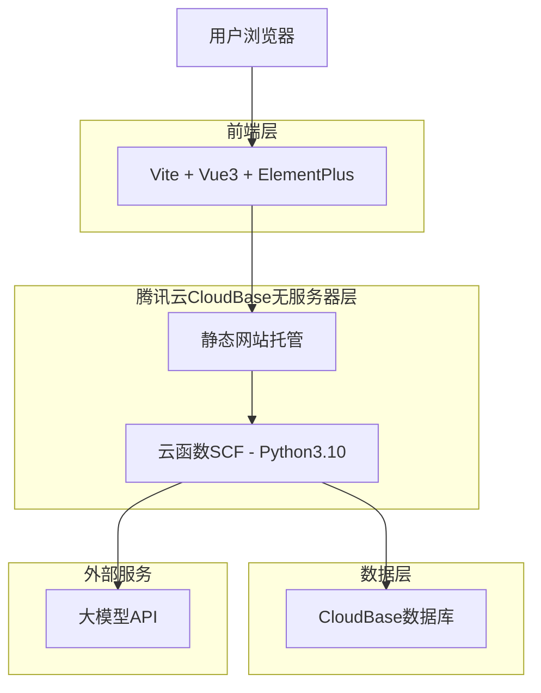
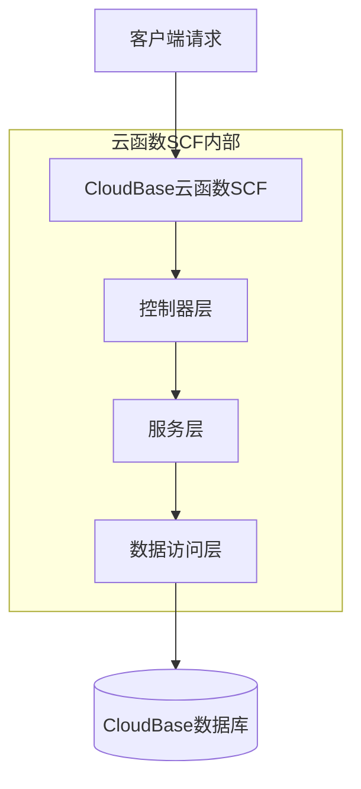
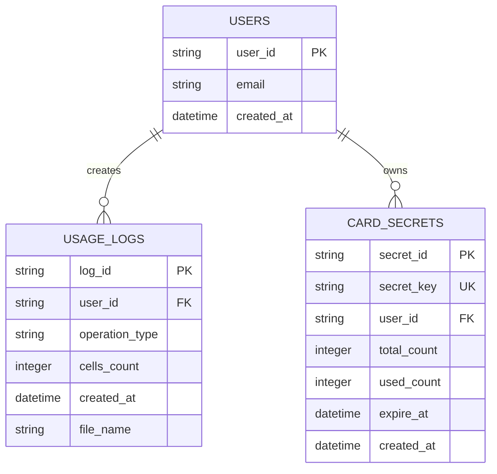

# 腾讯云CloudBase无服务器架构文档

## 1. 架构设计



## 2. 技术栈描述

- 前端：Vue3@3.4 + Vite@5 + ElementPlus@2
- 初始化工具：vite-init
- 后端：腾讯云CloudBase云函数SCF - Python3.10 Runtime
- 数据库：腾讯云CloudBase数据库TCB（文档数据库/NoSQL）
- 部署：前端CloudBase静态网站托管 + CDN加速

## 3. 云函数SCF定义

| 函数名称 | 触发方式 | 功能描述 |
|---------|---------|---------|
| auth-function | HTTP触发器 | 验证卡密有效性，返回用户信息和剩余次数 |
| parse-function | HTTP触发器 | 接收Excel文件，使用core/excel_parser.py解析文本，返回JSON预览 |
| translate-function | HTTP触发器 | 接收翻译请求，验证配额，调用大模型API，注入XML标签，返回Excel文件 |

## 4. API接口定义

### 4.1 认证相关
```
POST /api/auth/verify-key
```

请求：
| 参数名 | 类型 | 必填 | 描述 |
|--------|------|------|------|
| key | string | 是 | 卡密字符串 |

响应：
| 参数名 | 类型 | 描述 |
|--------|------|------|
| valid | boolean | 卡密是否有效 |
| user_id | string | 用户ID |
| remaining_count | number | 剩余使用次数 |

### 4.2 解析相关
```
POST /api/parse/excel
```

请求：
| 参数名 | 类型 | 必填 | 描述 |
|--------|------|------|------|
| file | File | 是 | Excel文件 |
| user_id | string | 是 | 用户ID |

响应：
| 参数名 | 类型 | 描述 |
|--------|------|------|
| preview | array | 解析后的文本预览 |
| total_cells | number | 总单元格数 |

### 4.3 翻译相关
```
POST /api/translate
```

请求：
| 参数名 | 类型 | 必填 | 描述 |
|--------|------|------|------|
| data | object | 是 | 翻译数据 |
| user_id | string | 是 | 用户ID |
| target_lang | string | 是 | 目标语言 |

响应：
| 参数名 | 类型 | 描述 |
|--------|------|------|
| file_url | string | 翻译后Excel文件URL |
| used_count | number | 本次使用次数 |

## 5. 服务器架构图



## 6. 数据模型

### 6.1 数据模型定义



### 6.2 数据定义语言

CloudBase数据库使用文档数据库结构，以下为等效的数据模型定义：

用户集合 (users)
```json
{
  "_id": "string",
  "email": "string",
  "created_at": "timestamp",
  "indexes": ["created_at"]
}
```

卡密集合 (card_secrets)
```json
{
  "_id": "string",
  "secret_key": "string",
  "user_id": "string",
  "total_count": "number",
  "used_count": "number", 
  "expire_at": "timestamp",
  "created_at": "timestamp",
  "indexes": ["secret_key", "user_id"]
}
```

使用记录集合 (usage_logs)
```json
{
  "_id": "string",
  "user_id": "string",
  "operation_type": "string",
  "cells_count": "number",
  "created_at": "timestamp",
  "file_name": "string",
  "indexes": ["user_id", "created_at"]
}
```

## 7. 核心逻辑说明

### 7.1 Excel解析逻辑
必须使用现有的 `core/excel_parser.py` 中的 Surgeon Mode 逻辑，该逻辑已证明能够保证翻译质量和格式完整性。前端JS解析风险过高，可能导致格式丢失。

### 7.2 翻译流程
1. 验证用户卡密有效性
2. 检查剩余使用次数
3. 调用大模型API进行翻译
4. 使用Python将翻译结果注入XML标签
5. 生成新的Excel文件
6. 更新用户使用记录

### 7.3 安全考虑
- 所有云函数SCF都需要CloudBase认证
- 数据库连接使用CloudBase内网访问
- 大模型API密钥存储在云函数SCF环境变量中
- 文件上传大小限制为10MB
- 使用CloudBase的用户权限管理系统