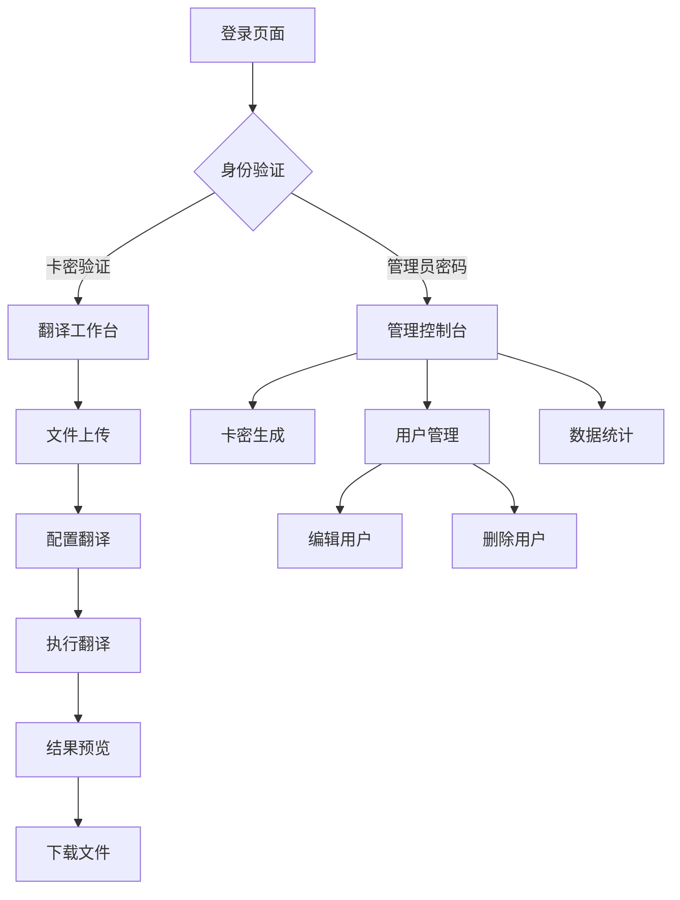

## 1. 产品概述
Excel大模型无损翻译系统是一个基于腾讯云CloudBase无服务器架构的智能Excel翻译SaaS平台，专为解决传统翻译工具无法保留复杂Excel格式的问题而设计。通过部署在腾讯云CloudBase云函数SCF上的Python服务，使用独创的"XML注入技术"（外科手术模式），实现像素级无损翻译，完美保留所有格式、样式、图片、图表、文本框等复杂元素。

产品采用前端Vue3 SPA + 腾讯云CloudBase云函数SCF + CloudBase数据库的无服务器架构，主要面向需要处理专业Excel文件翻译的企业用户、翻译公司、跨国贸易公司等机构，提供按次计费的灵活付费模式。

## 2. 核心功能

### 2.1 用户角色
| 角色 | 注册方式 | 核心权限 |
|------|----------|----------|
| 普通用户 | 卡密激活 | 上传Excel文件、选择翻译配置、下载翻译结果、查看剩余额度 |
| 管理员 | 预设账号密码 | 生成卡密、管理所有用户、查看系统统计、编辑用户权限 |

### 2.2 功能模块
系统包含以下核心页面：
1. **登录页面**：沉浸式登录界面，支持卡密激活和管理员登录
2. **翻译工作台**：文件上传、翻译配置、进度显示、结果预览、下载功能
3. **管理控制台**：卡密生成、用户管理、数据统计、系统配置

### 2.3 页面详情
| 页面名称 | 模块名称 | 功能描述 |
|----------|----------|----------|
| 登录页面 | 身份验证 | 输入卡密或管理员密码进行登录验证，支持错误提示和自动跳转 |
| 翻译工作台 | 文件上传 | 拖拽或选择上传.xlsx文件，支持文件格式验证和大小限制 |
| 翻译工作台 | 工作表选择 | 根据卡密类型显示可选工作表，全文件卡自动选择所有表 |
| 翻译工作台 | 翻译配置 | 选择目标语言、应用场景、过滤选项（忽略公式、数字、表头） |
| 翻译工作台 | 翻译执行 | 显示实时进度条，支持取消操作，完成后显示预览和下载 |
| 翻译工作台 | 结果预览 | 表格形式展示原文译文对照，最多显示100条，支持下载完整文件 |
| 管理控制台 | 卡密生成 | 选择卡密类型、数量、额度，一键生成批量卡密，支持复制导出 |
| 管理控制台 | 用户列表 | 表格展示所有用户信息，支持实时编辑类型、额度、过期时间 |
| 管理控制台 | 用户操作 | 单行编辑模式，支持保存修改、删除用户、取消操作 |
| 管理控制台 | 数据统计 | 实时显示总发卡量、各类型卡密数量、活跃用户等关键指标 |

## 3. 核心流程

### 普通用户流程
1. 用户访问部署在CloudBase静态网站托管上的Vue3应用，进入全屏登录页面
2. 输入购买的卡密，前端调用CloudBase云函数SCF的auth-function验证有效性
3. 验证通过后进入翻译工作台，侧边栏显示剩余额度
4. 上传Excel文件，前端调用parse-function进行文件解析
5. CloudBase云函数SCF使用core/excel_parser.py的Surgeon Mode解析文本，返回JSON预览
6. 用户配置翻译选项（语言、场景、过滤），点击开始翻译
7. 前端调用translate-function，SCF验证配额后调用大模型API
8. Python服务将翻译结果注入XML标签，生成新Excel文件，返回下载URL
9. 系统扣除相应额度，更新CloudBase数据库记录

### 管理员流程
1. 在登录页面输入管理员密码，通过SCF验证后进入管理控制台
2. 查看基于CloudBase数据库的实时数据统计概览（发卡量、用户分布等）
3. 在卡密生成区域创建新卡密，数据存储到CloudBase数据库
4. 在用户列表中查看所有卡密状态，支持搜索和筛选
5. 点击编辑按钮进入行内编辑模式，实时更新数据库记录
6. 执行删除操作移除无效卡密（保护内置管理员账户）
7. 可切换至翻译工作台体验完整的用户翻译流程

## 4. 用户界面设计

### 4.1 设计风格
- **主色调**：专业蓝(#2563eb)为主，科技灰(#6b7280)为辅，白色背景
- **按钮样式**：圆角矩形，主要操作为实心主色，次要操作为边框样式
- **字体规范**：系统默认字体，标题24-32px，正文14-16px，小字12px
- **布局风格**：卡片式布局，左侧边栏固定，主内容区域自适应
- **图标风格**：使用emoji图标，简洁直观，避免复杂图形

### 4.2 页面设计概述
| 页面名称 | 模块名称 | UI元素 |
|----------|----------|--------|
| 登录页面 | 背景区域 | 全屏渐变背景，毛玻璃效果，品牌logo居中显示 |
| 登录页面 | 登录卡片 | 半透明卡片悬浮效果，圆角边框，阴影深度8px |
| 登录页面 | 输入区域 | 密码输入框带图标，聚焦时边框高亮，错误状态红色提示 |
| 翻译工作台 | 上传区域 | 虚线边框拖拽区域，悬停时边框变色，支持点击选择文件 |
| 翻译工作台 | 配置面板 | 下拉选择器带标签，复选框开关，数字输入步进器 |
| 翻译工作台 | 进度显示 | 彩色进度条带百分比，状态文字实时更新，取消按钮醒目 |
| 翻译工作台 | 结果表格 | 斑马纹表格行，悬停高亮，固定表头，响应式列宽 |
| 管理控制台 | 统计卡片 | 大号数字指标，图标装饰，绿色表示正常，红色警告 |
| 管理控制台 | 操作表格 | 紧凑行高，操作按钮组，编辑状态特殊背景色 |
| 管理控制台 | 生成表单 | 分组表单区域，必填项红色星号，生成结果代码框 |

### 4.3 响应式设计
- **桌面优先**：针对1920x1080分辨率优化，支持最大2560px宽屏显示
- **平板适配**：768px-1024px宽度下侧边栏收起，表格横向滚动
- **移动支持**：小于768px时切换为单列布局，重要功能保留
- **触控优化**：按钮最小44px点击区域，支持触摸手势操作

### 4.4 交互体验
- **加载状态**：骨架屏占位，旋转动画，进度百分比显示
- **操作反馈**：成功绿色提示，错误红色警告，信息蓝色通知
- **过渡动画**：页面切换淡入淡出，按钮点击缩放效果，卡片悬停上浮
- **键盘支持**：Enter键登录，Tab键切换焦点，ESC键取消操作